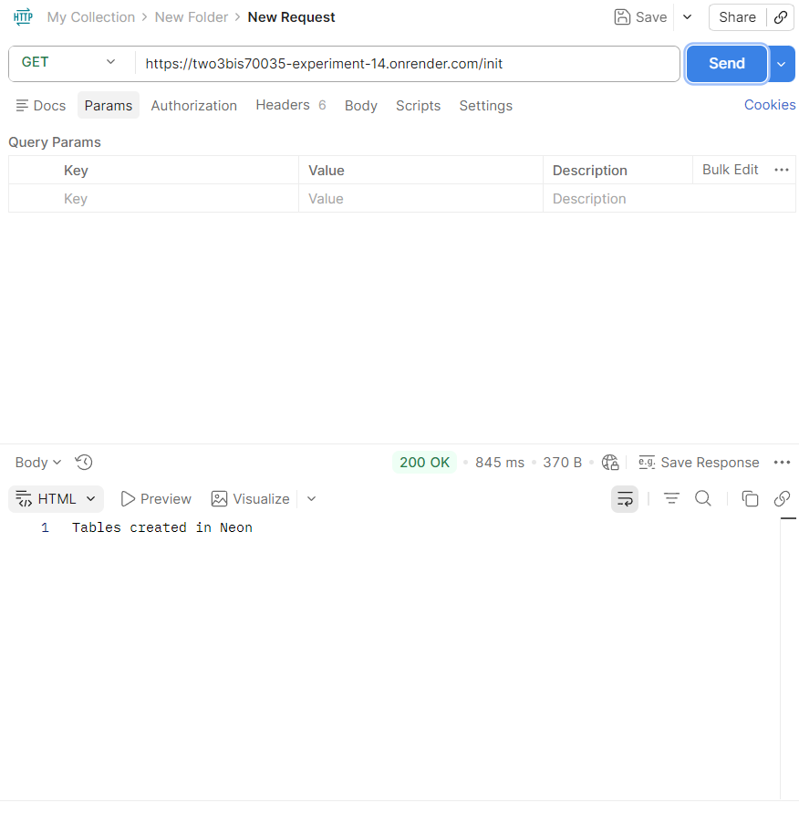
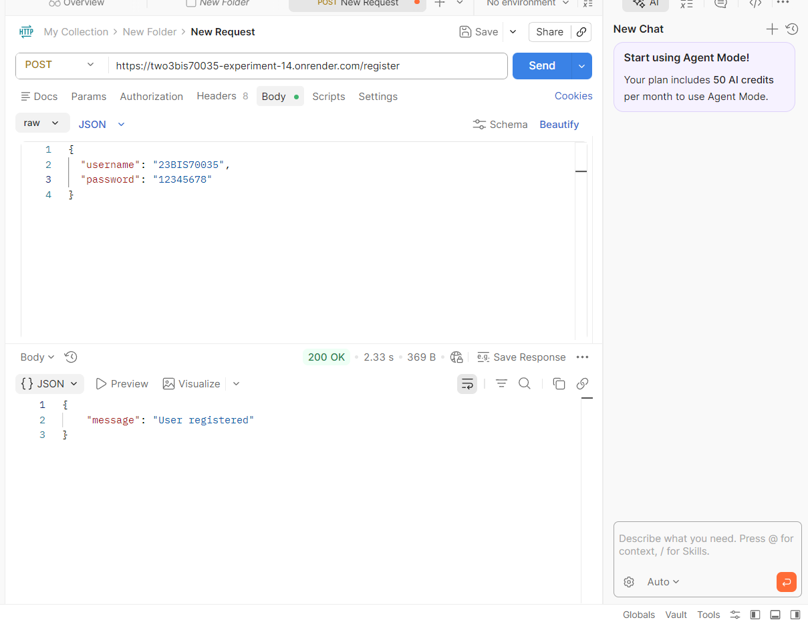
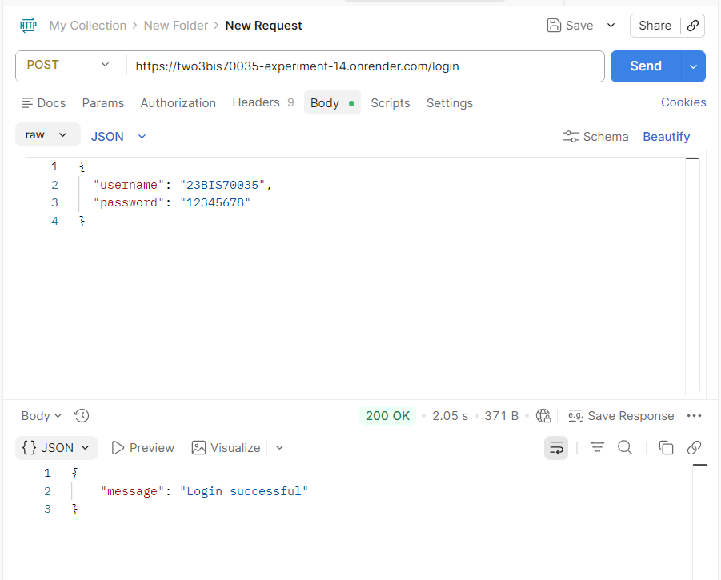

# Experiment 14: Secure Database Integration with Flask (Neon PostgreSQL)

## Aim
To implement secure database queries and validations using Flask by integrating a cloud-based PostgreSQL database (Neon), ensuring secure authentication and data handling.

## Tools Used
* Python (Flask)
* SQLAlchemy (ORM)
* Flask-Bcrypt
* PostgreSQL (Neon)
* Postman
* Render
* python-dotenv

## Procedure
### 1. Project Setup
* Created project files:
  * `app.py`
  * `.env`
  * `requirements.txt`
* Installed dependencies:
```bash
pip install flask flask_sqlalchemy flask_bcrypt psycopg2-binary python-dotenv
```

### 2. Database Configuration

* Created Neon PostgreSQL database
* Stored connection string in `.env`

```python
from dotenv import load_dotenv
import os

load_dotenv()
db_url = os.getenv("DATABASE_URL")
```

### 3. Model Creation

```python
from flask_sqlalchemy import SQLAlchemy

db = SQLAlchemy()

class User(db.Model):
    id = db.Column(db.Integer, primary_key=True)
    username = db.Column(db.String(100), unique=True, nullable=False)
    password = db.Column(db.String(255), nullable=False)
```

### 4. Security Implementation
#### Input Validation

* Checked for missing username and password
* Enforced minimum password length

#### Password Hashing

```python
from flask_bcrypt import Bcrypt

bcrypt = Bcrypt()

hashed_password = bcrypt.generate_password_hash(password).decode('utf-8')
```

#### SQL Injection Protection

* Used SQLAlchemy ORM
* Avoided raw SQL queries

---

### 5. API Endpoints

| Method | Endpoint    | Description            |
| ------ | ----------- | ---------------------- |
| GET    | `/`         | Check DB connection    |
| GET    | `/init`     | Create database tables |
| POST   | `/register` | Register new user      |
| POST   | `/login`    | Authenticate user      |

---

### 6. Deployment
Backend on Render -- 

**Start Command:**

```bash
gunicorn app:app
```

* Added environment variables in Render dashboard


### 7. Testing
* Used Postman to test all endpoints

* Database connection
* Table creation
* User registration
* Login authentication


## Screenshots

### GET `/` - Database Connected


### GET `/init` - Tables Created


### POST `/register` - User Registered


### POST `/login` - Login Successful


## Learning Outcomes
* Learned integration of Flask with Neon PostgreSQL
* Implemented secure database operations using SQLAlchemy ORM
* Applied password hashing using Flask-Bcrypt
* Prevented SQL Injection using ORM
* Gained hands-on experience with Postman API testing
* Deployed Flask application on Render
* Understood use of environment variables for security